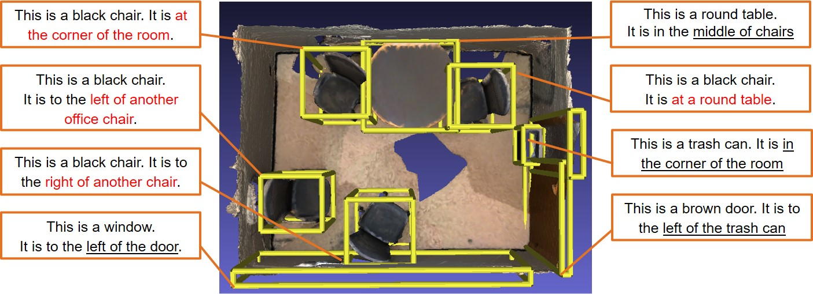

# SoftCap: Dense Captioning for 3D Scenes with SparseConv

<p align="center"></p>

## Introduction
We propose a model using SoftGroup based detection backbone. With sparse convolution and soft grouping mechanism, 
better detection performance and denser object features can be achieved, which enables the later language model to 
generate more reliable captions. A message passing graph model and an attention mechanism are used to aggregate object 
features with relational information. Our method can effectively localize and describe objects in 3D scenes and 
outperforms the existing baseline method with a significant improvement.

## Results
Quantitative results of 3D dense captioning on ScanRefer. All metrics are thresholded by IoU 0.5. Our method outperforms 
all baselines with a remarkable margin.

| Method      | Detection |   CIDEr   | BLEU-4 | METEOR | ROUGE | Detection<br/>mAP |
|:------------|:---------|:---------:|:------:|:------:|:-----:|:-------------------:|
| Scan2Cap    |  VoteNet  |   15.71   |  9.01  |  7.18  | 14.92 | 32.09             |
| X-Trans2Cap |  VoteNet  |   17.64   |  9.68  |  7.21  | 15.25 | 35.31             |
| More        |  VoteNet  |   16.46   |  8.86  |  7.12  | 14.71 | 31.93             |
| Ours(CE)    | SoftGroup |   30.76   | 16.30  | **13.83**  | 28.41 | 57.22             |
| **Ours(CIDEr)** |        **SoftGroup**   | **36.27** | **18.66**  | 13.82  | **29.13** | **57.38**             |

## Installation
1. Environment requirements

* Python 3.8
* Pytorch 1.11
* CUDA 11.3

The following installation guild suppose ``python=3.8`` ``pytorch=1.11`` and ``cuda=11.3``. You may change them according to your system.

Create a conda virtual environment and activate it.
```
conda create -n softgroup python=3.8
conda activate softgroup
```

2. Clone the repository.
```
git clone https://github.com/LuckyMax0722/SoftCap.git
```


3. Install the dependencies.
```
conda install pytorch cudatoolkit=11.3 -c pytorch
pip install spconv-cu113
pip install -r requirements.txt
```

4. Install build requirement.

```
sudo apt-get install libsparsehash-dev
```


For detail information, please refer to [SoftGroup/Installation](https://github.com/thangvubk/SoftGroup/blob/main/docs/installation.md)

Please pay attention that we process the setup based on python 3.8 and CUDA 11.3.
You can follow SoftGroup installation to build the setup and then replace our ``/ops`` folder with yours.

## Data Preparation
[SoftCap/Data Preparation](data/README.md)

Please refer to [SoftGroup/Data Preparation/ScanNet](https://github.com/thangvubk/SoftGroup/blob/main/dataset/README.md#scannet-v2-dataset)
and [Scan2Cap/Data Preparation](https://github.com/daveredrum/Scan2Cap/blob/main/README.md#data-preparation)

## Pretrained Models
For SoftGroup pretrained models, please refer to the following table. Be aware that we do a re-labeling process before pretrain because the labeling in SoftGroup is not adapt to ScanRefer Dataset.

|    Model    |                                           Download                                         |
|:-----------:|:-------------------------------------------------------------------------------------------:|
| SoftGroup(re-label) | [model](https://drive.google.com/file/d/1hf_ew-7PM7IcPhZnuHF487VmdDfSHZpN/view?usp=drive_link) |

For detail information about SoftGroup, please refer to [SoftGroup/Pretrained Models](https://github.com/thangvubk/SoftGroup#instance-segmentation)

For SoftCap pretrained models, please refer to the following table

|  Model  | Network Architecture | Loss  |                                           Download                                         |
|:-------:|:--------------------:|:-----:|:-------------------------------------------------------------------------------------------:|
| SoftCap | SoftGroup + RG + CAC |  CE   | [model](https://drive.google.com/file/d/1mn0TIUHtftwOovRTyVgbfs1qZLWmdCM_/view?usp=drive_link) |
| SoftCap | SoftGroup + RG + CAC | CIDEr | [model](https://drive.google.com/file/d/1uf9jKmRVX1WIbvAlPAisp9ALao3hdRnB/view?usp=drive_link) |

## Training
```shell
cd scripts
python train.py
```

## Visualization
```shell
cd scripts
python eval.py
```

